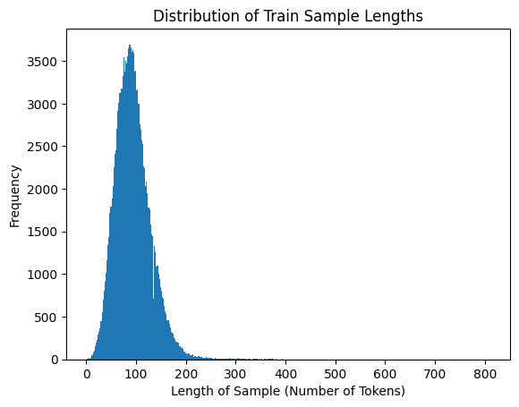
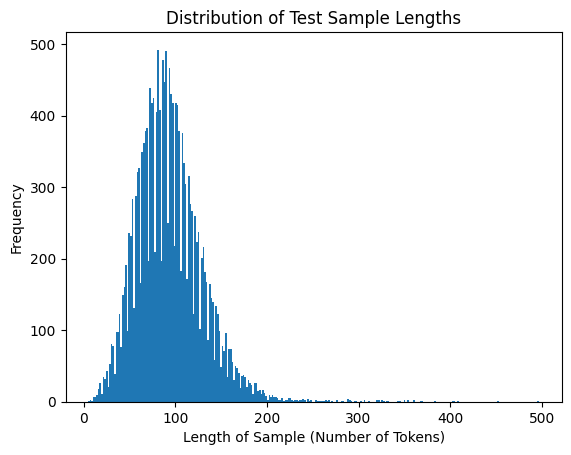

# Keyphrase Extraction with Neural Networks

## Introduction

We worked on key phrase extraction for research papers, using both bidirectional LSTM and BERT models. We fed the models research paper titles and abstracts, and their output was a set of labelled key phrases that were mentioned within the input text. 

This project is interesting because it allowed us to explore different approaches to key phrase extraction and compare the performance of these two state-of-the-art architectures in the specific context of scientific literature, offering valuable insights into their effectiveness for this crucial NLP task.

## Datasets

### Sci-HTC:

We got to know about this dataset through https://github.com/msadat3/SciHTC/blob/main/README.md and contacted __THIS PERSON__ to get access to the whole dataset (as mentioned in the link). This dataset contains a total of 167546 research papers, split into 148929 for training and 18617 for testing. 

### INSPEC:

We got to know about this dataset when we were reading papers and articles on key phrase extraction and came across this paper: "Bidirectional LSTM Recurrent Neural Network For Keyphrase Extraction" by Marco Basaldella, Elisa Antolli, Giuseppe Serra and Carlo Tasso. This dataset is available on https://huggingface.co/datasets/memray/inspec. This dataset contains a total of 2000 research papers, split into 1500 for training/validation and 500 for testing. 

> How do your model(s) work? (explain) Point out any important details regarding your approaches to unknown words, training, decoding, etc.

## The Model: bi-LSTM for Key-phrase Extraction

### Input & Pre-process

From our dataset, we extracted 18000 random training samples, and we concatenate the 'title' and ‘abstract’ to be the input for the model. An input sample looks like this:

    Title:      Toward identifying inter-project clone sets for building useful libraries
    Abstract:   The present paper discusses how clone sets can be generated from an very large amount of source code. The knowledge of clone sets can help to manage software asset. For example, we can figure out the state of the asset easier, or we can build more useful libraries based on the knowledge.

Each input sample is first normalized by converting all to lower-case, and removing special characters.

    # keeping non-alphabetic char, space, and hyphen
    text = re.sub('[^\w\s-]', '', text)

They are then further pre-processed by applying tokenization, English stopwords Removal, lemmatization. These processes are done using `nltk.corpus.stopwords`, `nltk.tokenize.word_tokenize`, and `nltk.stem.WordNetLemmatizer`. The pre-processed input from the above example looks like this:

    ['toward', 'identifying', 'inter-project', 'clone', 'set', 'building', 'useful', 'library', 'present', 'paper', 'discus', 'clone', 'set', 'generated', 'large', 'amount', 'source', 'code', 'knowledge', 'clone', 'set', 'help', 'manage', 'software', 'asset', 'example', 'figure', 'state', 'asset', 'easier', 'build', 'useful', 'library', 'based', 'knowledge']

Padding and truncation are applied to these input tokens for the sequential model. To decide on the max length for setting the input, we mapped out the length (number of tokens) distribution over the pre-processed input from our traning samples. The max length is eventually set to 250 because about 98% of the train samples is within this length. We did experiment with other length settings as well to see how that affect our results, and a few experiments will be presented in later section.

We experimented with <integer indices as input + embedding layer within the model> versus <pre-defined word embeddings as input + no embedding layer within the model>, the later approach gave better results. The final input to our model is the padded input tokens converted to embedding vectors using **word embeddings `GloVe 50`** to better capture contextual information.

**Unknown Words** are represented by a vector of 0s with the length of embeddings dimension.

**Label**  
Labels are generated by marking the input sequences with the pre-defined key-phrases provided in the dataset, in the form of `['code clone', 'reengineering for libraries']`. We applied the same process used for cleaning input to clean the phrases, so they are normalized into the same form as the input tokens. Each label is list of binary value of the same length as the padded input tokens. `label[i] = 1` if `input_tokens[i]` is part of the pre-defined key-phrases; otherwise `label[i] = 0`.

### Model Setup

To avoid training again, we have trained and saved 3 bi-LSTM models. All models were trained till 5 epochs with the maxLen of 500. The details and tunings are:
1. Model 1:
    - Trained using partial dataset = 50000 records
    - LSTM Units = 64
    - LSTM Dropouts = 0.3, 0.2
    - Training time = 2 hours
2. Model 2:
    - Trained using the whole dataset = 148929 records
    - LSTM Units = 32
    - LSTM Dropouts = 0.3, 0.2
    - Training time = 2.5 hours
3. Model 3:
    - Trained using the whole dataset = 148929 records
    - LSTM Units = 32
    - LSTM Dropouts = 0.5, 0.3
    - Training time = 2.5 hours

### Output & Inferrence

The output from the model is a list of probabilities, one for each token in the padded input tokens. We used an output layer with sigmoid activation for making binary prediction. `preds[i]` represents the likelihood of `input_tokens[i]` being a keyword. The predicted probabilities are in the range of 0 to 1, we initially used a threshold of 0.5 to convert them into binary predictions, however almost all of the labels becomes 0. We investigated the original predictions and learned that almost all predicted probabilities is below 0.5. The threshold is eventually lowered to between 0.3 and 0.35 for our later experiments.

The orinal `input_tokens[i]` is then used to convert `preds[i]` back to keywords: `input_tokens[i]` is a predicted keyword if `binary_preds[i]` = 1.

### Experiments & Results

The accuracy evaluted by the model during training remains in the range of 0.17 to 0.2, which is not ideal. One explanation for the low training accuracy could be that the threshold for binary classification is typically set to 0.5 by default, however almost all predictions in our experiments are below 0.4. We lowered the threshold at inferrence time and later we've learned that we could have also set a custom thresdols for the model's traning evaluation:

    model.fit(X_padded, Y_binary, epochs=num_epochs, batch_size=batch_size, threshold=0.7)

Overall, despite the low accurary score, we are still able to see many overlaps between the pre-defined key phrases and our predicted keywords with a threshold of around 0.35. Our key findings are:

- Not all pre-defined keyphrases appear in our input sequences ('title' + 'abstract'), and the model's performence is largely affected by that. Therefore, the quality of the training data and label is essentially to our task.
- Low accuracy does not necessarily mean bad performance, the interpretation is task dependent.

The details of a few experiments are shown below:

**Experiment 1:**  
training sample=10000, embedding dim=50, maxLen=350, epoch=5, batchSize=32

    # 4m 17.5s
    Epoch 1/5
    2023-12-05 17:39:38.704371: I tensorflow/core/grappler/optimizers/custom_graph_optimizer_registry.cc:117] Plugin optimizer for device_type GPU is enabled.
    313/313 [==============================] - 60s 168ms/step - loss: 0.1556 - accuracy: 0.1800
    Epoch 2/5
    313/313 [==============================] - 46s 148ms/step - loss: 0.1257 - accuracy: 0.1904
    Epoch 3/5
    313/313 [==============================] - 45s 145ms/step - loss: 0.1256 - accuracy: 0.1928
    Epoch 4/5
    313/313 [==============================] - 51s 163ms/step - loss: 0.1256 - accuracy: 0.1773
    Epoch 5/5
    313/313 [==============================] - 53s 168ms/step - loss: 0.1256 - accuracy: 0.1775

Some predictions it gives by using a threshold of 0.3 when converting probablity distribution to binary prediction:

    actual: ['spectral learning', 'transfer learning']
    predicted: ['domain-transfer', 'learning', 'traditional', 'spectral', 'classification']
    actual: ['case study', 'verification and validation', 'very-large-scale software system']
    predicted: ['study', 'testing', 'commissioning', 'operation']
    actual: ['assistive technology', 'context aware mobile system', 'end-user programming', 'technology abandonment']
    predicted: ['user', 'programming', 'context', 'responsiveness']
    actual: ['collision avoidance', 'human-like character', 'motion planning', 'multiagent system', 'object grasping']
    predicted: ['conquer', 'freewill', 'framework', 'aim']
    actual: ['human-robot interaction', 'mood induction procedure']
    predicted: ['language', 'mood', 'induction', 'procedure']

The 3 models were evaluated using Precision, Recall, and F1 score. The results are:
1. Model 1:
    - Precision: 0.412834837415843
    - Recall: 0.08446658851113717
    - F1: 0.14023989683949298

2. Model 2:
    - Precision: 0.401831757627847
    - Recall: 0.1096204572098476
    - F1: 0.1722506217187068

3. Model 3: 
    - Precision: 0.46538114843959366
    - Recall: 0.13996556271981242
    - F1: 0.21520670095253117

## Pre-trained BERT

## Comparing Bi-LSTM with Pre-trained BERT

## Summary & Future Explorations

This project explored the use of bidirectional LSTMs for key phrase extraction from research paper titles and abstracts. 

We compared three models with different configurations and parameters and Model 3 performed best, achieving a better balance between precision and recall. These findings provide a promising foundation for further exploration of LSTM-based key phrase extraction techniques.

Some of the limitations we faced during the key-phrase extraction process were:
1. Due to limited computational resources, all models were trained for only 5 epochs. This might have prevented them from reaching their full potential in terms of accuracy and generalizability.
2. The labels in the dataset included words and phrases that were not present in the title + abstract of respective research papers. This would make it difficult for the models to understand how those labels got selected and how to comprehend them.
3. For this project, only the title and abstract sections of the research papers were used to train the models. Using the whole research (or more sections like Introduction and Conclusion) would be better as the model would get more contextual information on the key words and phrases.
4. The models did not understant the semantic context of the input data, example - "digital fine art", and processed them as individual words. So the models were able to predict "digitial" during testing, but not the whole term. 

By addressing these limitations and exploring new avenues, this project's findings can contribute to the development of more accurate, interpretable, and versatile key phrase extraction systems for various scientific and NLP applications.

## Reference
1. https://github.com/msadat3/SciHTC/blob/main/README.md
2. https://huggingface.co/datasets/memray/inspec
3. https://towardsdatascience.com/bert-technology-introduced-in-3-minutes-2c2f9968268c#